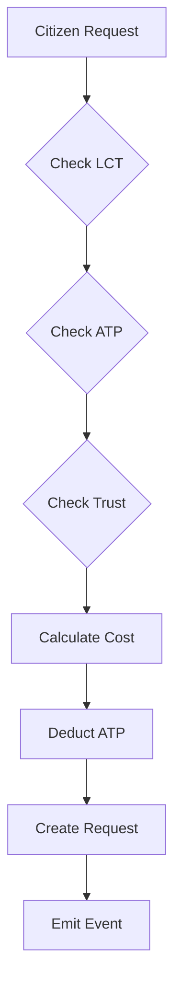

# Society Todo System - Complete Implementation

## Overview

The Society Todo System is a revolutionary Web4 task management framework that treats digital societies as living organisms with wake/sleep cycles, energy management, and democratic task prioritization.

## Core Concepts

### 1. Wake/Sleep Cycles

Societies operate in distinct energy states, automatically transitioning based on ATP levels:

```
[HIBERNATING] ←→ [SLEEPING] ←→ [CONSERVING] ←→ [ACTIVE] ←→ [AWAKENING]
   (< 10%)        (< 25%)        (< 50%)        (> 75%)     (transition)
```

**State Characteristics:**
- **Hibernating**: Minimal operations, emergency-only (10% efficiency)
- **Sleeping**: Critical tasks only (25% efficiency)  
- **Conserving**: High-priority tasks (50% efficiency)
- **Active**: Full operations (100% efficiency)
- **Awakening**: Transitioning to active (75% efficiency)

### 2. Citizen Request Flow



**Request Requirements:**
- Valid citizen LCT
- Sufficient ATP balance
- Trust level for priority requests (80+ for critical)
- Society must be accepting requests

### 3. ATP Delegation System

**Quadratic Voting Formula:**
```
voting_power = sqrt(atp_amount) * (trust_level / 100)
```

**Delegation Pools:**
- **Emergency Pool**: Critical society operations
- **Innovation Pool**: New features and improvements
- **Community Service Pool**: Public goods
- **Maintenance Pool**: Routine operations

### 4. Cross-Society Federation

**Sharing Models:**
- **50/50 Split**: Equal cost sharing
- **Proportional**: Based on benefit received
- **Auction**: Competitive bidding
- **Trust-Based**: Automatic based on T3 levels

## Implementation Details

### Module Structure

```
x/societytodo/
├── keeper/
│   ├── keeper.go           # Core keeper logic
│   ├── msg_server.go       # Message handlers
│   ├── wake_sleep.go       # Cycle management
│   └── delegation.go       # ATP delegation
├── types/
│   ├── keys.go            # Store keys
│   ├── todo.pb.go         # Protobuf types
│   └── msgs.go            # Message types
└── module.go              # Module registration
```

### Key Functions

#### CreateSocietyTodoList
```go
func (k Keeper) CreateSocietyTodoList(ctx sdk.Context, societyLCT string) error {
    // Initialize with 1M ATP budget
    // Set initial state to AWAKENING
    // Configure 24-hour default cycle
}
```

#### ProcessWakeSleepCycle
```go
func (k Keeper) ProcessWakeSleepCycle(ctx sdk.Context) {
    // Check ATP levels
    // Transition states based on thresholds
    // Adjust energy efficiency
    // Update cycle metrics
}
```

#### RequestTodo
```go
func (k msgServer) RequestTodo(goCtx context.Context, msg *MsgRequestTodo) {
    // Verify citizen identity
    // Calculate ATP cost
    // Check trust requirements
    // Create and store request
}
```

#### DelegateATP
```go
func (k msgServer) DelegateATP(goCtx context.Context, msg *MsgDelegateATP) {
    // Verify citizen and pool
    // Calculate voting power
    // Lock tokens until period expires
    // Update pool metrics
}
```

### State Transitions

| Current State | ATP Level | Next State | Action |
|--------------|-----------|------------|--------|
| Any | < 10% | HIBERNATING | Emergency only |
| Any | < 25% | SLEEPING | Critical only |
| ACTIVE | < 50% | CONSERVING | Reduce operations |
| Any | > 75% | AWAKENING → ACTIVE | Full operations |

### ATP Cost Calculation

```go
cost = base_cost * priority_multiplier * complexity

where:
  base_cost = 1000 ATP
  priority_multiplier:
    - CRITICAL: 5x
    - HIGH: 3x
    - MEDIUM: 2x
    - LOW: 1x
  complexity: 1-10 scale
```

### ADP Generation

```go
adp_reward = atp_spent * quality_score * 1.1 (efficiency bonus)
```

## Integration Points

### With LCT Manager
- Identity verification for citizens
- Society LCT validation
- Permission checking

### With Energy Cycle
- ATP balance management
- ADP generation on completion
- Energy transfer to pools

### With Trust Tensor
- T3 requirements for priority
- Voting power calculations
- Cross-society trust verification

### With MRH
- Context boundaries for visibility
- Witness requirements for critical todos
- Cross-society context sharing

### With Pairing Module
- Secure execution sessions
- Component capability matching
- Device pairing for IoT tasks

## Usage Examples

### 1. Create Society Todo List
```bash
racecarwebd tx societytodo create-list \
  --society-lct="society_001" \
  --from=alice
```

### 2. Request Todo
```bash
racecarwebd tx societytodo request \
  --title="Upgrade consensus algorithm" \
  --description="Implement new BFT consensus" \
  --priority=high \
  --complexity=8 \
  --society="society_001" \
  --from=bob
```

### 3. Delegate ATP
```bash
racecarwebd tx societytodo delegate \
  --pool="innovation_pool" \
  --amount=10000atp \
  --society="society_001" \
  --from=charlie
```

### 4. Process Todo
```bash
racecarwebd tx societytodo process \
  --todo-id="todo_123" \
  --action=complete \
  --quality=0.95 \
  --proof="ipfs://QmProofHash" \
  --from=executor
```

## Performance Metrics

### Cycle Efficiency
```
efficiency = (todos_completed / total_todos) * energy_efficiency
```

### Society Health Score
```
health = (atp_available / atp_total) * completion_rate * trust_average
```

### Federation Collaboration Index
```
collaboration = shared_todos * success_rate * trust_factor
```

## Security Considerations

1. **ATP Drainage Protection**: Maximum limits per todo and per cycle
2. **Trust Requirements**: Critical operations require high T3 scores
3. **Delegation Locks**: Minimum lock periods prevent gaming
4. **Federation Limits**: Trust-based caps on cross-society requests
5. **Emergency Reserves**: 10% ATP always reserved for critical ops

## Future Enhancements

1. **Predictive Scheduling**: ML-based wake/sleep optimization
2. **Dynamic Pricing**: Market-based ATP cost discovery
3. **Reputation System**: Long-term contributor rewards
4. **Task Templates**: Reusable todo patterns
5. **Automated Execution**: Smart contract task runners

## Conclusion

The Society Todo System creates a living, breathing task management ecosystem where:
- Societies conserve energy through intelligent state management
- Citizens democratically allocate resources through delegation
- Cross-society collaboration emerges through federation
- Quality is rewarded through ADP generation
- Trust integrates deeply into all operations

This implementation demonstrates Web4's vision of societies as autonomous, energy-conscious entities that collaborate while maintaining sovereignty.