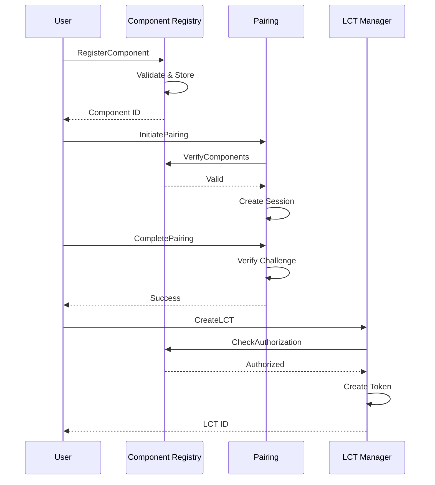
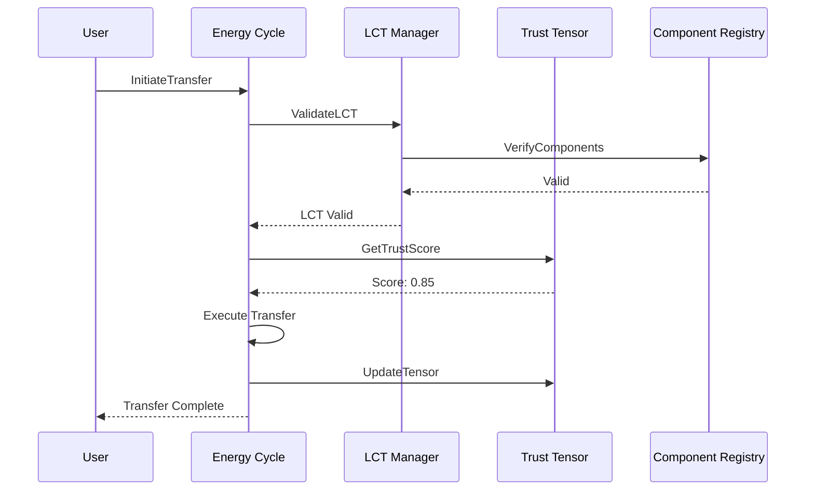
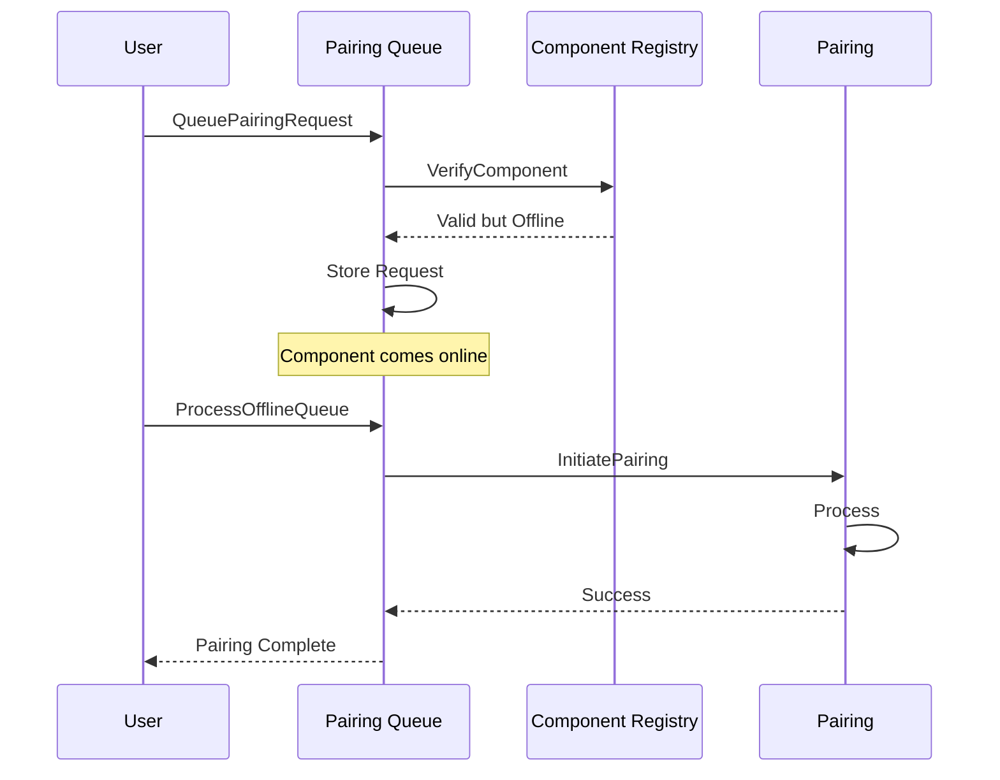

# Module Relationships and Interactions

## Table of Contents

1. [Overview](#overview)
2. [Module Dependency Matrix](#module-dependency-matrix)
3. [Interaction Patterns](#interaction-patterns)
4. [Data Flow Between Modules](#data-flow-between-modules)
5. [Transaction Chains](#transaction-chains)
6. [Event Propagation](#event-propagation)
7. [Common Workflows](#common-workflows)

## Overview

The Web4-ModBatt blockchain modules are designed to work together as an integrated system. Each module has specific responsibilities but depends on others to complete complex operations. This document details how modules interact and coordinate to deliver the complete functionality.

## Module Dependency Matrix

### Direct Dependencies

| Module | Depends On | Used By |
|--------|-----------|---------|
| **Component Registry** | None | LCT Manager, Pairing, Pairing Queue, Energy Cycle |
| **LCT Manager** | Component Registry | Energy Cycle, Trust Tensor |
| **Pairing** | Component Registry | Pairing Queue |
| **Pairing Queue** | Component Registry, Pairing | None |
| **Energy Cycle** | Component Registry, LCT Manager, Trust Tensor | None |
| **Trust Tensor** | LCT Manager | Energy Cycle |

### Dependency Graph
```
┌─────────────────────┐
│ Component Registry  │ ◄── Foundation (no dependencies)
└──────────┬──────────┘
           │
     ┌─────┴─────┬──────────────┬────────────────┐
     ▼           ▼              ▼                ▼
┌─────────┐ ┌─────────┐ ┌──────────────┐ ┌──────────────┐
│   LCT   │ │ Pairing │ │   Pairing    │ │              │
│ Manager │ │         │ │    Queue     │ │              │
└────┬────┘ └─────────┘ └──────────────┘ │              │
     │           ▲              ▲         │              │
     │           └──────────────┘         │              │
     │                                    │              │
     ▼                                    ▼              │
┌─────────────┐                    ┌──────────────┐     │
│Trust Tensor │ ◄──────────────────┤Energy Cycle  │ ◄───┘
└─────────────┘                    └──────────────┘
```

## Interaction Patterns

### 1. Registration → Pairing → LCT Creation



### 2. Energy Transfer with Trust Validation



### 3. Offline Pairing Queue Processing



## Data Flow Between Modules

### Component Registration Flow
```
Input: Component Details
   │
   ▼
Component Registry
   ├─► Store: Component Identity
   ├─► Store: Public Key
   └─► Event: ComponentRegistered
        │
        ▼
   Other Modules (Listen)
```

### LCT Creation Flow
```
Input: Component IDs + Relationship Type
   │
   ▼
LCT Manager
   ├─► Query: Component Registry (Verify)
   ├─► Store: LCT Token
   ├─► Store: Component Relationships
   └─► Event: LCTCreated
        │
        ▼
   Energy Cycle & Trust Tensor (React)
```

### Energy Operation Flow
```
Input: Transfer Request
   │
   ▼
Energy Cycle
   ├─► Query: LCT Manager (Validate)
   ├─► Query: Trust Tensor (Check Score)
   ├─► Store: Energy Operation
   ├─► Update: ATP/ADP Balances
   └─► Events: EnergyTransferred
        │
        ▼
   Trust Tensor (Update Scores)
```

## Transaction Chains

### Complete Component Onboarding
```
1. RegisterComponent
   └─► 2. UpdateAuthorization
       └─► 3. InitiateBidirectionalPairing
           └─► 4. CompletePairing
               └─► 5. CreateLCTRelationship
                   └─► 6. CreateRelationshipTensor
```

### Energy Exchange Workflow
```
1. ValidateLCTAccess
   └─► 2. CalculateRelationshipTrust
       └─► 3. CreateRelationshipEnergyOperation
           └─► 4. ExecuteEnergyTransfer
               └─► 5. UpdateTensorScore
                   └─► 6. AddTensorWitness
```

### Offline Device Handling
```
1. QueuePairingRequest
   └─► 2. [Device Comes Online]
       └─► 3. ProcessOfflineQueue
           └─► 4. InitiateBidirectionalPairing
               └─► 5. CompletePairing
                   └─► 6. CreateLCTRelationship
```

## Event Propagation

### Event Flow Architecture
```
Module A (Emit Event)
         │
         ▼
    Event Manager
         │
    ┌────┴────┬────────┬──────────┐
    ▼         ▼        ▼          ▼
Module B  Module C  External   Indexers
(React)   (React)   Listeners
```

### Key Events and Listeners

| Event | Emitted By | Consumed By | Purpose |
|-------|-----------|-------------|---------|
| `component_registered` | Component Registry | LCT Manager, Pairing | New component available |
| `pairing_completed` | Pairing | LCT Manager | Enable LCT creation |
| `lct_created` | LCT Manager | Energy Cycle, Trust Tensor | New relationship established |
| `energy_transferred` | Energy Cycle | Trust Tensor | Update trust scores |
| `trust_updated` | Trust Tensor | Energy Cycle | Adjust transfer limits |
| `authorization_changed` | Component Registry | All modules | Update permissions |

### Event Processing Example
```go
// Trust Tensor listening for energy transfers
func (k Keeper) HandleEnergyTransferEvent(ctx sdk.Context, event EnergyTransferEvent) {
    // Update trust score based on successful transfer
    tensor, found := k.GetRelationshipTensor(ctx, event.LCT_ID)
    if found {
        newScore := calculateUpdatedTrust(tensor, event.Amount, event.Success)
        k.UpdateTensorScore(ctx, tensor.ID, newScore)
    }
}
```

## Common Workflows

### 1. New Battery Module Integration
```
1. Manufacturer registers module component
2. Module paired with pack controller
3. LCT created for module-controller relationship
4. Trust tensor initialized with base score
5. Energy operations enabled based on trust
```

### 2. Energy Balancing Across Modules
```
1. Controller identifies imbalance
2. Queries trust scores for all modules
3. Creates energy operations for high-trust modules
4. Executes transfers in priority order
5. Updates trust scores based on performance
```

### 3. Faulty Component Isolation
```
1. Anomalous behavior detected
2. Trust score rapidly decreased
3. Energy operations restricted
4. Component authorization revoked
5. Isolation event propagated to network
```

### 4. Offline Module Replacement
```
1. Replacement request queued
2. Old module marked for removal
3. New module comes online
4. Queue processed, pairing completed
5. LCTs transferred to new module
6. Trust history partially inherited
```

## Module Interaction Best Practices

### 1. Keeper Dependencies
- Always inject keeper interfaces, not concrete types
- Define minimal interface requirements
- Mock interfaces for testing

### 2. Event-Driven Communication
- Prefer events over direct keeper calls for loose coupling
- Include all necessary data in events
- Version events for backward compatibility

### 3. Transaction Atomicity
- Group related operations in single transactions
- Implement proper rollback mechanisms
- Validate all preconditions upfront

### 4. State Consistency
- Use blockchain state as single source of truth
- Avoid caching that could become stale
- Implement proper locking for concurrent access

### 5. Error Propagation
- Return meaningful errors from keeper methods
- Wrap errors with context
- Handle all error cases explicitly