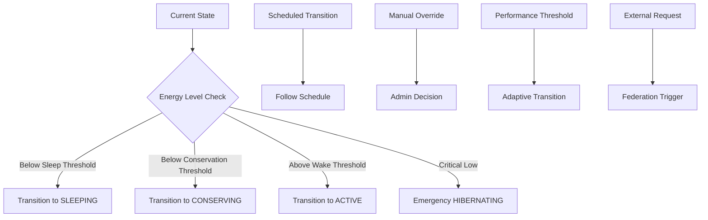

# Web4 Society Todo List System - Technical Design Document

## Executive Summary

This document presents a comprehensive technical design for a Web4 society todo list system built on the ACT (Artificial Communication Transport) blockchain. The system implements sophisticated wake/sleep cycles for energy conservation, citizen request flows with ATP cost modeling, delegation mechanisms for task prioritization, and cross-society federation protocols.

## Table of Contents

1. [System Architecture](#system-architecture)
2. [Data Structures](#data-structures)
3. [State Machine Design](#state-machine-design)
4. [ATP Energy Flow](#atp-energy-flow)
5. [Wake/Sleep Cycle Logic](#wakesleep-cycle-logic)
6. [Citizen Request Flows](#citizen-request-flows)
7. [Delegation Mechanisms](#delegation-mechanisms)
8. [Cross-Society Federation](#cross-society-federation)
9. [Integration Points](#integration-points)
10. [Implementation Considerations](#implementation-considerations)

## System Architecture

### Core Components

```
┌─────────────────────────────────────────────────────────────────┐
│                    Web4 Society Todo System                     │
├─────────────────────────────────────────────────────────────────┤
│  ┌─────────────────┐  ┌─────────────────┐  ┌─────────────────┐ │
│  │   Todo Manager  │  │ State Machine   │  │  ATP Manager    │ │
│  │                 │  │                 │  │                 │ │
│  │ • Creation      │  │ • Wake/Sleep    │  │ • Allocation    │ │
│  │ • Assignment    │  │ • Transitions   │  │ • Consumption   │ │
│  │ • Execution     │  │ • Scheduling    │  │ • Generation    │ │
│  │ • Completion    │  │ • Monitoring    │  │ • Budgeting     │ │
│  └─────────────────┘  └─────────────────┘  └─────────────────┘ │
├─────────────────────────────────────────────────────────────────┤
│  ┌─────────────────┐  ┌─────────────────┐  ┌─────────────────┐ │
│  │ Delegation Pool │  │ Federation Hub  │  │ Request Queue   │ │
│  │                 │  │                 │  │                 │ │
│  │ • ATP Pooling   │  │ • Society Links │  │ • Validation    │ │
│  │ • Voting        │  │ • Sharing Rules │  │ • Prioritization│ │
│  │ • Allocation    │  │ • Cost Sharing  │  │ • Scheduling    │ │
│  │ • Governance    │  │ • Trust Checks  │  │ • Monitoring    │ │
│  └─────────────────┘  └─────────────────┘  └─────────────────┘ │
└─────────────────────────────────────────────────────────────────┘
                               │
        ┌──────────────────────┼──────────────────────┐
        │                      │                      │
┌───────▼─────────┐    ┌───────▼─────────┐    ┌───────▼─────────┐
│   LCT Manager   │    │  Energy Cycle   │    │  Trust Tensor   │
│                 │    │                 │    │                 │
│ • Identity      │    │ • ATP/ADP       │    │ • T3/V3         │
│ • Crypto Keys   │    │ • Discharge     │    │ • Relationships │
│ • Birth Certs   │    │ • Recharge      │    │ • Propagation   │
│ • MRH Context   │    │ • R6 Validation │    │ • Distance      │
└─────────────────┘    └─────────────────┘    └─────────────────┘
        │                      │                      │
┌───────▼─────────┐    ┌───────▼─────────┐    ┌───────▼─────────┐
│      MRH        │    │    Pairing      │    │ Component Reg   │
│                 │    │                 │    │                 │
│ • Context Bound │    │ • Device Auth   │    │ • Capabilities  │
│ • Witness Net   │    │ • Sessions      │    │ • Verification  │
│ • Traversal     │    │ • Collaboration │    │ • Matching      │
│ • Storage       │    │ • Security      │    │ • Trust Scores  │
└─────────────────┘    └─────────────────┘    └─────────────────┘
```

## Data Structures

### Core Proto Definitions

The system is built on three main protobuf definitions:

1. **`todo.proto`** - Core todo data structures and citizen requests
2. **`state_machine.proto`** - Wake/sleep cycle state management
3. **`integration.proto`** - Integration points with existing ACT modules

#### Key Data Structures

**SocietyTodoList**
```protobuf
message SocietyTodoList {
  string society_lct = 1;
  SocietyState state = 3;
  CycleInfo current_cycle = 4;
  AtpBudget atp_budget = 5;
  repeated TodoItem active_todos = 6;
  repeated DelegationPool delegation_pools = 8;
  FederationConfig federation_config = 9;
}
```

**TodoItem**
```protobuf
message TodoItem {
  string id = 1;
  string title = 2;
  string requester_lct = 4;
  TodoPriority priority = 5;
  TodoStatus status = 6;
  AtpCostAnalysis atp_cost = 7;
  TrustRequirement trust_requirement = 11;
  repeated DelegationVote delegations = 12;
}
```

**SocietyStateMachine**
```protobuf
message SocietyStateMachine {
  string society_lct = 1;
  SocietyState current_state = 2;
  repeated StateTransition state_history = 3;
  EnergyProfile energy_profile = 4;
  PerformanceMetrics performance = 5;
  CycleSchedule schedule = 6;
  EmergencyProtocols emergency_protocols = 7;
}
```

## State Machine Design

### Society States

The system implements five primary operational states:

```
     HIBERNATING ←──────┐
         │              │
         ▼              │
     SLEEPING           │
         │              │
         ▼              │
    CONSERVING          │ Emergency
         │              │ Shutdown
         ▼              │
      ACTIVE            │
         │              │
         ▼              │
    AWAKENING ─────────┘
```

#### State Descriptions

1. **HIBERNATING** (5)
   - Deep sleep, maintenance only
   - Minimal ATP consumption
   - Emergency-only responses
   - System integrity preservation

2. **SLEEPING** (4)
   - Dormant state
   - Emergency processing only
   - Critical system monitoring
   - Scheduled wake capability

3. **CONSERVING** (3)
   - Reduced activity mode
   - Selective todo processing
   - High-priority tasks only
   - Energy optimization focus

4. **ACTIVE** (2)
   - Full operational state
   - All todo types processed
   - Maximum throughput
   - Standard energy consumption

5. **AWAKENING** (1)
   - Transition from sleep to active
   - System warmup phase
   - Gradual capacity increase
   - Performance optimization

### State Transition Triggers



### State Transition Logic

```go
// Pseudocode for state transition evaluation
func evaluateStateTransition(society *SocietyStateMachine) StateTransition {
    current := society.CurrentState
    atp := society.EnergyProfile.CurrentAtp
    thresholds := society.EnergyProfile.Thresholds

    // Emergency conditions first
    if atp.LTE(thresholds.CriticalShutdownThreshold) {
        return StateTransition{
            FromState: current,
            ToState: SOCIETY_STATE_HIBERNATING,
            Trigger: STATE_TRANSITION_TRIGGER_EMERGENCY,
        }
    }

    // Normal energy-based transitions
    switch current {
    case SOCIETY_STATE_ACTIVE:
        if atp.LTE(thresholds.ConservationThreshold) {
            return transitionTo(SOCIETY_STATE_CONSERVING, ATP_LOW)
        }
    case SOCIETY_STATE_CONSERVING:
        if atp.LTE(thresholds.SleepThreshold) {
            return transitionTo(SOCIETY_STATE_SLEEPING, ATP_LOW)
        }
        if atp.GTE(thresholds.WakeThreshold) {
            return transitionTo(SOCIETY_STATE_ACTIVE, ATP_HIGH)
        }
    case SOCIETY_STATE_SLEEPING:
        if atp.LTE(thresholds.HibernationThreshold) {
            return transitionTo(SOCIETY_STATE_HIBERNATING, ATP_LOW)
        }
        if atp.GTE(thresholds.WakeThreshold) {
            return transitionTo(SOCIETY_STATE_AWAKENING, ATP_HIGH)
        }
    case SOCIETY_STATE_HIBERNATING:
        if atp.GTE(thresholds.WakeThreshold) {
            return transitionTo(SOCIETY_STATE_AWAKENING, ATP_HIGH)
        }
    case SOCIETY_STATE_AWAKENING:
        // Awakening is a transitional state
        return transitionTo(SOCIETY_STATE_ACTIVE, SCHEDULED)
    }

    // Check scheduled transitions
    if scheduled := checkScheduledTransitions(society); scheduled != nil {
        return *scheduled
    }

    // No transition needed
    return StateTransition{FromState: current, ToState: current}
}
```

## ATP Energy Flow

### Energy Flow Architecture

```
┌─────────────────────────────────────────────────────────────────┐
│                    ATP Energy Flow Diagram                      │
├─────────────────────────────────────────────────────────────────┤
│                                                                 │
│  Society ATP Treasury                                           │
│  ┌─────────────────────────────────────────────────────────────┐│
│  │ Total: 10,000 ATP                                          ││
│  │ ┌─────────────┐ ┌─────────────┐ ┌─────────────┐ ┌─────────┐││
│  │ │ Available   │ │ Reserved    │ │ Allocated   │ │Emergency│││
│  │ │ 6,000 ATP   │ │ 2,000 ATP   │ │ 1,500 ATP   │ │500 ATP  │││
│  │ └─────────────┘ └─────────────┘ └─────────────┘ └─────────┘││
│  └─────────────────────────────────────────────────────────────┘│
│                          │                                     │
│          ┌───────────────┼───────────────┐                     │
│          ▼               ▼               ▼                     │
│  ┌─────────────┐ ┌─────────────┐ ┌─────────────┐               │
│  │ Todo Pool   │ │Delegation   │ │ Emergency   │               │
│  │ 4,000 ATP   │ │ Pool        │ │ Reserve     │               │
│  │             │ │ 2,000 ATP   │ │ 500 ATP     │               │
│  └─────────────┘ └─────────────┘ └─────────────┘               │
│          │               │                                     │
│          ▼               ▼                                     │
│  ┌─────────────┐ ┌─────────────┐                               │
│  │Active Todos │ │ Delegated   │                               │
│  │ 1,500 ATP   │ │ Todos       │                               │
│  │ Allocated   │ │ 500 ATP     │                               │
│  └─────────────┘ └─────────────┘                               │
│          │               │                                     │
│          ▼               ▼                                     │
│     Todo Execution  Delegation Votes                           │
│          │               │                                     │
│          ▼               ▼                                     │
│    ┌─────────────────────────────────────┐                    │
│    │         ADP Generation               │                    │
│    │                                     │                    │
│    │ ┌─────────────┐ ┌─────────────────┐ │                    │
│    │ │ Executor    │ │ Society         │ │                    │
│    │ │ 70% ADP     │ │ 20% ADP         │ │                    │
│    │ └─────────────┘ └─────────────────┘ │                    │
│    │ ┌─────────────┐                     │                    │
│    │ │ Witnesses   │                     │                    │
│    │ │ 10% ADP     │                     │                    │
│    │ └─────────────┘                     │                    │
│    └─────────────────────────────────────┘                    │
│                          │                                     │
│                          ▼                                     │
│                   ATP Recharge Cycle                           │
│                   (ADP → ATP Conversion)                       │
└─────────────────────────────────────────────────────────────────┘
```

### ATP Allocation Strategy

```go
// ATP Allocation Algorithm
func allocateATP(society *SocietyTodoList, todo *TodoItem) error {
    budget := society.AtpBudget
    cost := todo.AtpCost.TotalEstimated

    // 1. Check availability
    if budget.Available.LT(cost) {
        return errors.New("insufficient ATP available")
    }

    // 2. Check per-todo limits
    if cost.GT(budget.MaxPerTodo) {
        return errors.New("todo exceeds maximum ATP limit")
    }

    // 3. Check cycle limits
    currentCycleUsage := calculateCurrentCycleUsage(society)
    if currentCycleUsage.Add(cost).GT(budget.MaxPerCycle) {
        return errors.New("would exceed cycle ATP limit")
    }

    // 4. Priority-based allocation
    switch todo.Priority {
    case TODO_PRIORITY_EMERGENCY:
        // Can use emergency reserve if needed
        if budget.Available.LT(cost) &&
           budget.EmergencyReserve.GTE(cost) {
            return allocateFromEmergencyReserve(todo, cost)
        }
    case TODO_PRIORITY_CRITICAL:
        // Can use reserved ATP
        if budget.Available.LT(cost) &&
           budget.Reserved.GTE(cost) {
            return allocateFromReserved(todo, cost)
        }
    }

    // 5. Standard allocation
    return allocateFromAvailable(todo, cost)
}
```

### Energy Conservation Strategies

1. **Predictive Scheduling**
   - Forecast energy consumption based on historical patterns
   - Schedule high-energy tasks during peak generation periods
   - Defer non-critical tasks during low-energy periods

2. **Dynamic Throttling**
   - Reduce concurrent todo execution during energy conservation
   - Implement backpressure mechanisms for request queuing
   - Prioritize energy-efficient execution paths

3. **Collaborative Energy Sharing**
   - Pool ATP resources across delegation groups
   - Share excess energy with federated societies
   - Implement energy trading mechanisms

## Wake/Sleep Cycle Logic

### Cycle Scheduling Algorithm

```go
type CycleScheduler struct {
    society *SocietyStateMachine
    predictor *EnergyPredictor
    optimizer *ScheduleOptimizer
}

func (cs *CycleScheduler) calculateOptimalSchedule() *CycleSchedule {
    // 1. Analyze historical performance
    historical := cs.society.Performance.HistoricalCycles
    patterns := analyzeEnergyPatterns(historical)

    // 2. Predict future energy needs
    predictions := cs.predictor.predictEnergyConsumption(patterns)

    // 3. Optimize schedule for efficiency
    schedule := cs.optimizer.optimizeSchedule(predictions)

    // 4. Apply adaptive adjustments
    if cs.society.Schedule.EnableAdaptiveScheduling {
        schedule = cs.applyAdaptiveAdjustments(schedule)
    }

    return schedule
}

func (cs *CycleScheduler) applyAdaptiveAdjustments(
    base *CycleSchedule,
) *CycleSchedule {
    config := cs.society.Schedule.AdaptiveConfig

    for _, factor := range config.Factors {
        if !factor.Enabled {
            continue
        }

        switch factor.FactorName {
        case "citizen_activity_patterns":
            base = cs.adjustForCitizenActivity(base, factor.Weight)
        case "federation_coordination":
            base = cs.adjustForFederationSync(base, factor.Weight)
        case "emergency_frequency":
            base = cs.adjustForEmergencyPatterns(base, factor.Weight)
        case "trust_building_opportunities":
            base = cs.adjustForTrustBuilding(base, factor.Weight)
        }
    }

    return base
}
```

### Energy Monitoring System

```go
type EnergyMonitor struct {
    society string
    thresholds *EnergyThresholds
    subscribers []EventSubscriber
}

func (em *EnergyMonitor) monitorEnergyLevels() {
    ticker := time.NewTicker(30 * time.Second)
    defer ticker.Stop()

    for {
        select {
        case <-ticker.C:
            current := em.getCurrentEnergyLevel()
            em.evaluateThresholds(current)
            em.updatePredictions(current)

        case <-em.emergencyChannel:
            em.handleEmergencyShutdown()
        }
    }
}

func (em *EnergyMonitor) evaluateThresholds(current sdk.Int) {
    if current.LTE(em.thresholds.CriticalShutdownThreshold) {
        em.triggerEmergencyShutdown()
    } else if current.LTE(em.thresholds.HibernationThreshold) {
        em.triggerStateTransition(SOCIETY_STATE_HIBERNATING)
    } else if current.LTE(em.thresholds.SleepThreshold) {
        em.triggerStateTransition(SOCIETY_STATE_SLEEPING)
    } else if current.LTE(em.thresholds.ConservationThreshold) {
        em.triggerStateTransition(SOCIETY_STATE_CONSERVING)
    }
}
```

## Citizen Request Flows

### Request Processing Pipeline

```
┌─────────────────────────────────────────────────────────────────┐
│                 Citizen Request Processing Flow                 │
├─────────────────────────────────────────────────────────────────┤
│                                                                 │
│  1. Citizen Request Submission                                  │
│  ┌─────────────────────────────────────────────────────────────┐│
│  │ • Request validation (LCT, rights, format)                 ││
│  │ • Initial ATP cost estimation                              ││
│  │ • Priority assessment                                      ││
│  │ • Required capabilities identification                     ││
│  └─────────────────────────────────────────────────────────────┘│
│                            ▼                                   │
│  2. Society Review Process                                      │
│  ┌─────────────────────────────────────────────────────────────┐│
│  │ • Trust verification (requester → society)                 ││
│  │ • MRH context checking                                     ││
│  │ • ATP budget availability                                  ││
│  │ • Society constitution compliance                          ││
│  │ • Conflict detection with existing todos                   ││
│  └─────────────────────────────────────────────────────────────┘│
│                            ▼                                   │
│  3. ATP Cost Analysis                                           │
│  ┌─────────────────────────────────────────────────────────────┐│
│  │ • Detailed resource estimation                             ││
│  │ • Executor capability matching                             ││
│  │ • Dependency analysis                                      ││
│  │ • Risk assessment and contingency planning                 ││
│  └─────────────────────────────────────────────────────────────┘│
│                            ▼                                   │
│  4. Delegation Opportunity                                      │
│  ┌─────────────────────────────────────────────────────────────┐│
│  │ • Community voting period                                  ││
│  │ • ATP delegation collection                                ││
│  │ • Priority boost calculation                               ││
│  │ • Consensus threshold evaluation                           ││
│  └─────────────────────────────────────────────────────────────┘│
│                            ▼                                   │
│  5. Final Approval/Rejection                                    │
│  ┌─────────────────────────────────────────────────────────────┐│
│  │ • Society consensus mechanism                              ││
│  │ • Law oracle consultation (if required)                   ││
│  │ • Final ATP allocation                                     ││
│  │ • Todo creation or rejection notice                        ││
│  └─────────────────────────────────────────────────────────────┘│
└─────────────────────────────────────────────────────────────────┘
```

### Request Validation Algorithm

```go
func validateCitizenRequest(
    request *CitizenTodoRequest,
    society *Society,
) *ValidationResult {
    result := &ValidationResult{}

    // 1. LCT Validation
    lct, err := validateLCT(request.RequesterLct)
    if err != nil {
        result.AddError("invalid_lct", err.Error())
        return result
    }

    // 2. Society Membership
    if !isSocietyMember(lct.Id, society.LctId) {
        result.AddError("not_member", "requester is not a society member")
        return result
    }

    // 3. Rights Verification
    requiredRights := []string{"todo_request", "atp_allocation"}
    if !hasRequiredRights(lct, requiredRights) {
        result.AddError("insufficient_rights",
            "requester lacks required rights")
        return result
    }

    // 4. Trust Requirements
    trustLevel := calculateTrustLevel(request.RequesterLct, society.LctId)
    if trustLevel.LT(society.Constitution.MinTrustForRequests) {
        result.AddError("insufficient_trust",
            "requester trust level too low")
        return result
    }

    // 5. ATP Contribution Validation
    if request.OfferedAtp.LT(society.Constitution.MinAtpContribution) {
        result.AddWarning("low_atp_contribution",
            "ATP contribution below recommended minimum")
    }

    // 6. Request Rate Limiting
    if isRateLimited(request.RequesterLct) {
        result.AddError("rate_limited",
            "requester has exceeded request rate limit")
        return result
    }

    result.Valid = len(result.Errors) == 0
    return result
}
```

### Cost Estimation Model

```go
type CostEstimator struct {
    historicalData *HistoricalCostData
    complexityModel *ComplexityModel
    resourcePricing *ResourcePricing
}

func (ce *CostEstimator) estimateAtpCost(
    request *CitizenTodoRequest,
) *AtpCostAnalysis {
    analysis := &AtpCostAnalysis{}

    // 1. Base complexity estimation
    complexity := ce.complexityModel.calculateComplexity(request)

    // 2. Resource requirements
    resources := ce.estimateResourceRequirements(request, complexity)

    // 3. Cost breakdown
    analysis.EstimatedComputeCost = ce.calculateComputeCost(
        resources.ComputeUnits, complexity.ComputeComplexity)

    analysis.EstimatedNetworkCost = ce.calculateNetworkCost(
        resources.NetworkCalls, complexity.NetworkComplexity)

    analysis.EstimatedStorageCost = ce.calculateStorageCost(
        resources.StorageBytes, complexity.StorageComplexity)

    // 4. Historical adjustment
    historicalFactor := ce.getHistoricalFactor(request.Title,
        request.RequiredCapabilities)

    // 5. Uncertainty factor
    uncertainty := ce.calculateUncertainty(complexity, resources)
    analysis.EstimationConfidence = 100 - uncertainty

    // 6. Total with buffer
    total := analysis.EstimatedComputeCost.
        Add(analysis.EstimatedNetworkCost).
        Add(analysis.EstimatedStorageCost)

    buffer := total.MulRaw(int64(uncertainty)).QuoRaw(100)
    analysis.TotalEstimated = total.Add(buffer)

    return analysis
}
```

## Delegation Mechanisms

### Delegation Pool Architecture

```
┌─────────────────────────────────────────────────────────────────┐
│                      Delegation Pool System                     │
├─────────────────────────────────────────────────────────────────┤
│                                                                 │
│  ┌─────────────────────────────────────────────────────────────┐│
│  │                Global ATP Pool                              ││
│  │                                                             ││
│  │  Specialized Pools:                                         ││
│  │  ┌─────────────┐ ┌─────────────┐ ┌─────────────────────────┐││
│  │  │ Emergency   │ │ Innovation  │ │ Community Service       │││
│  │  │ Response    │ │ & Research  │ │ & Social Good          │││
│  │  │ 500 ATP     │ │ 1,200 ATP   │ │ 800 ATP                │││
│  │  └─────────────┘ └─────────────┘ └─────────────────────────┘││
│  │                                                             ││
│  │  ┌─────────────┐ ┌─────────────┐ ┌─────────────────────────┐││
│  │  │ Infrastructure │ │ Education │ │ Economic Development   │││
│  │  │ & Maintenance  │ │ & Knowledge│ │ & Business Support    │││
│  │  │ 700 ATP        │ │ 600 ATP    │ │ 400 ATP               │││
│  │  └─────────────┘ └─────────────┘ └─────────────────────────┘││
│  └─────────────────────────────────────────────────────────────┘│
│                                                                 │
│  ┌─────────────────────────────────────────────────────────────┐│
│  │                 Allocation Rules Engine                     ││
│  │                                                             ││
│  │  Rule Examples:                                             ││
│  │  • Priority = EMERGENCY → Auto-allocate from Emergency Pool││
│  │  • Category = "research" → Route to Innovation Pool        ││
│  │  • Time = Night → Lower allocation threshold               ││
│  │  • Requester Trust > 0.8 → Fast-track approval            ││
│  │  • Cross-society todo → Special federation handling       ││
│  └─────────────────────────────────────────────────────────────┘│
│                                                                 │
│  ┌─────────────────────────────────────────────────────────────┐│
│  │                  Voting Mechanism                           ││
│  │                                                             ││
│  │  ┌─────────────┐   Voting Types:   ┌─────────────────────┐ ││
│  │  │ Quadratic   │   • Quadratic     │ Time-Weighted       │ ││
│  │  │ Voting      │   • Conviction    │ Conviction          │ ││
│  │  │ (Default)   │   • Reputation    │ (Long-term)         │ ││
│  │  └─────────────┘   • Time-weighted └─────────────────────┘ ││
│  │                                                             ││
│  │  Voting Weight = sqrt(ATP_delegated) × Trust_factor        ││
│  │                 × Reputation_multiplier                     ││
│  └─────────────────────────────────────────────────────────────┘│
└─────────────────────────────────────────────────────────────────┘
```

### Delegation Voting Algorithm

```go
type DelegationVoting struct {
    pools map[string]*DelegationPool
    votingRules *VotingRules
    trustCalculator *TrustCalculator
}

func (dv *DelegationVoting) processVote(
    vote *DelegationVote,
    todo *TodoItem,
) error {
    // 1. Validate delegator eligibility
    if err := dv.validateDelegator(vote.DelegatorLct); err != nil {
        return err
    }

    // 2. Calculate voting weight
    weight := dv.calculateVotingWeight(vote, todo)

    // 3. Apply vote to todo
    todo.Delegations = append(todo.Delegations, vote)

    // 4. Update priority based on delegated ATP
    newPriority := dv.calculateAdjustedPriority(todo)
    todo.Priority = newPriority

    // 5. Check automatic allocation rules
    for _, pool := range dv.pools {
        if dv.shouldAutoAllocate(pool, todo) {
            if err := dv.allocateFromPool(pool, todo); err != nil {
                continue // Try next pool
            }
            break
        }
    }

    return nil
}

func (dv *DelegationVoting) calculateVotingWeight(
    vote *DelegationVote,
    todo *TodoItem,
) sdk.Dec {
    // Base weight from ATP delegation (quadratic voting)
    baseWeight := sdk.NewDecFromInt(vote.DelegatedAtp).
        Power(sdk.NewDecWithPrec(5, 1)) // sqrt

    // Trust factor between delegator and requester
    trustFactor := dv.trustCalculator.calculateTrust(
        vote.DelegatorLct, todo.RequesterLct)

    // Reputation multiplier
    reputation := dv.getReputationScore(vote.DelegatorLct)
    reputationMultiplier := sdk.OneDec().Add(
        reputation.QuoInt64(10)) // 1 + (reputation/10)

    // Time decay for conviction voting
    timeDecay := dv.calculateTimeDecay(vote.DelegatedAt)

    return baseWeight.
        Mul(trustFactor).
        Mul(reputationMultiplier).
        Mul(timeDecay)
}

func (dv *DelegationVoting) shouldAutoAllocate(
    pool *DelegationPool,
    todo *TodoItem,
) bool {
    totalWeight := sdk.ZeroDec()
    for _, vote := range todo.Delegations {
        weight := dv.calculateVotingWeight(vote, todo)
        totalWeight = totalWeight.Add(weight)
    }

    // Check allocation rules
    for _, rule := range pool.AllocationRules {
        if !rule.Enabled {
            continue
        }

        if dv.evaluateAllocationConditions(rule.Conditions, todo) {
            threshold := sdk.NewDecFromInt(rule.AllocationAmount).
                QuoInt64(100) // Convert to weight threshold

            if totalWeight.GTE(threshold) {
                return true
            }
        }
    }

    return false
}
```

### Pool Governance System

```go
type PoolGovernance struct {
    pool *DelegationPool
    proposals map[string]*GovernanceProposal
    votes map[string]*GovernanceVote
}

type GovernanceProposal struct {
    ProposalId string
    ProposalType GovernanceProposalType
    Title string
    Description string
    Changes string // JSON-encoded changes

    Proposer string
    ProposedAt time.Time
    VotingEndsAt time.Time

    VotesFor sdk.Dec
    VotesAgainst sdk.Dec
    VotesAbstain sdk.Dec

    Status ProposalStatus
}

func (pg *PoolGovernance) submitProposal(
    proposal *GovernanceProposal,
) error {
    // 1. Validate proposer eligibility
    if !pg.isEligibleProposer(proposal.Proposer) {
        return errors.New("proposer not eligible")
    }

    // 2. Validate proposal content
    if err := pg.validateProposal(proposal); err != nil {
        return err
    }

    // 3. Set voting period
    proposal.VotingEndsAt = time.Now().Add(
        time.Duration(pg.pool.Governance.VotingPeriodSeconds) * time.Second)

    // 4. Store proposal
    pg.proposals[proposal.ProposalId] = proposal

    // 5. Notify pool contributors
    pg.notifyContributors(proposal)

    return nil
}

func (pg *PoolGovernance) processVote(
    vote *GovernanceVote,
) error {
    proposal := pg.proposals[vote.ProposalId]
    if proposal == nil {
        return errors.New("proposal not found")
    }

    // Check voting eligibility and weight
    contributor := pg.getContributor(vote.VoterLct)
    if contributor == nil {
        return errors.New("voter not a pool contributor")
    }

    votingPower := contributor.VotingPower

    // Apply vote
    switch vote.Vote {
    case GOVERNANCE_VOTE_YES:
        proposal.VotesFor = proposal.VotesFor.Add(votingPower)
    case GOVERNANCE_VOTE_NO:
        proposal.VotesAgainst = proposal.VotesAgainst.Add(votingPower)
    case GOVERNANCE_VOTE_ABSTAIN:
        proposal.VotesAbstain = proposal.VotesAbstain.Add(votingPower)
    }

    pg.votes[vote.VoteId] = vote

    // Check if proposal passes
    if pg.checkProposalResult(proposal) {
        return pg.executeProposal(proposal)
    }

    return nil
}
```

## Cross-Society Federation

### Federation Architecture

```
┌─────────────────────────────────────────────────────────────────┐
│                    Cross-Society Federation                     │
├─────────────────────────────────────────────────────────────────┤
│                                                                 │
│  Society A                 Federation Hub               Society B │
│  ┌─────────────┐           ┌─────────────┐             ┌─────────┐│
│  │ Todo List   │◄─────────►│ Trust       │◄───────────►│Todo List││
│  │             │           │ Verification│             │         ││
│  │ • Local     │           │             │             │• Local  ││
│  │ • Shared    │           │ ┌─────────┐ │             │• Shared ││
│  │ • Received  │           │ │ Sharing │ │             │• Recv'd ││
│  └─────────────┘           │ │ Policies│ │             └─────────┘│
│         │                  │ └─────────┘ │                   │   │
│         │                  │             │                   │   │
│  ┌─────────────┐           │ ┌─────────┐ │             ┌─────────┐│
│  │ATP Budget   │◄─────────►│ │   ATP   │ │◄───────────►│ATP      ││
│  │Management   │           │ │Cost     │ │             │Budget   ││
│  │             │           │ │Sharing  │ │             │Mgmt     ││
│  │• Allocation │           │ └─────────┘ │             │         ││
│  │• Sharing    │           │             │             │• Alloc  ││
│  │• Billing    │           │ ┌─────────┐ │             │• Share  ││
│  └─────────────┘           │ │Federation│ │             └─────────┘│
│                            │ │Consensus│ │                       │
│  Society C                 │ └─────────┘ │               Society D │
│  ┌─────────────┐           │             │             ┌─────────┐│
│  │Emergency    │◄─────────►│ ┌─────────┐ │◄───────────►│Specialized││
│  │Response     │           │ │Emergency│ │             │Services ││
│  │Team         │           │ │Protocols│ │             │         ││
│  │             │           │ └─────────┘ │             │• AI/ML  ││
│  │• 24/7 Avail │           └─────────────┘             │• Research││
│  │• Critical   │                                       │• Analysis││
│  │  Tasks      │                                       └─────────┘│
│  └─────────────┘                                                 │
└─────────────────────────────────────────────────────────────────┘
```

### Federation Trust Protocol

```go
type FederationTrustProtocol struct {
    localSociety string
    trustedSocieties map[string]*TrustedSociety
    trustCalculator *TrustCalculator
    validator *CrossSocietyValidator
}

func (ftp *FederationTrustProtocol) validateCrossSocietyTodo(
    todo *TodoItem,
    fromSociety string,
) *ValidationResult {
    result := &ValidationResult{}

    // 1. Check if society is trusted
    trusted := ftp.trustedSocieties[fromSociety]
    if trusted == nil {
        result.AddError("untrusted_society",
            "society not in trusted federation")
        return result
    }

    // 2. Verify society trust level
    if trusted.TrustLevel.Competence.LT(sdk.NewDecWithPrec(7, 1)) { // 0.7
        result.AddError("insufficient_society_trust",
            "society trust level too low")
        return result
    }

    // 3. Check ATP allocation limits
    maxAllocation := trusted.MaxAtpAllocation
    requestedAtp := todo.AtpCost.TotalEstimated

    if requestedAtp.GT(maxAllocation) {
        result.AddError("exceeds_atp_limit",
            "requested ATP exceeds society limit")
        return result
    }

    // 4. Validate sharing policies
    for _, policy := range ftp.getSharingPolicies() {
        if !ftp.evaluatePolicy(policy, todo, fromSociety) {
            result.AddError("policy_violation",
                fmt.Sprintf("violates sharing policy: %s", policy.Name))
            return result
        }
    }

    // 5. Cross-verify with MRH context
    if !ftp.verifyMrhContext(todo, fromSociety) {
        result.AddWarning("mrh_context_mismatch",
            "limited MRH context overlap")
    }

    result.Valid = len(result.Errors) == 0
    return result
}

func (ftp *FederationTrustProtocol) negotiateCostSharing(
    todo *TodoItem,
    fromSociety string,
    executingSociety string,
) *CostSharingAgreement {
    agreement := &CostSharingAgreement{
        TodoId: todo.Id,
        RequestingSociety: fromSociety,
        ExecutingSociety: executingSociety,
        TotalCost: todo.AtpCost.TotalEstimated,
    }

    // Find applicable sharing policy
    policy := ftp.findApplicableSharingPolicy(todo, fromSociety)

    switch policy.CostSharing {
    case COST_SHARING_MODEL_REQUESTER_PAYS:
        agreement.RequesterShare = agreement.TotalCost
        agreement.ExecutorShare = sdk.ZeroInt()

    case COST_SHARING_MODEL_EXECUTOR_PAYS:
        agreement.RequesterShare = sdk.ZeroInt()
        agreement.ExecutorShare = agreement.TotalCost

    case COST_SHARING_MODEL_SPLIT_50_50:
        half := agreement.TotalCost.QuoRaw(2)
        agreement.RequesterShare = half
        agreement.ExecutorShare = agreement.TotalCost.Sub(half)

    case COST_SHARING_MODEL_PROPORTIONAL:
        // Based on benefit received and society capabilities
        proportion := ftp.calculateProportionalShare(todo, fromSociety)
        agreement.RequesterShare = agreement.TotalCost.
            MulRaw(int64(proportion * 100)).QuoRaw(100)
        agreement.ExecutorShare = agreement.TotalCost.
            Sub(agreement.RequesterShare)

    case COST_SHARING_MODEL_AUCTION:
        // Implement auction mechanism for competitive pricing
        agreement = ftp.conductCostAuction(todo, fromSociety)
    }

    return agreement
}
```

### Federation Consensus Mechanism

```go
type FederationConsensus struct {
    participatingSocieties []string
    consensusThreshold sdk.Dec
    votingPeriod time.Duration
}

func (fc *FederationConsensus) requestCrossSocietyApproval(
    todo *TodoItem,
    targetSocieties []string,
) (*FederationApproval, error) {
    approval := &FederationApproval{
        TodoId: todo.Id,
        RequestedSocieties: targetSocieties,
        VotingDeadline: time.Now().Add(fc.votingPeriod),
        Votes: make(map[string]*FederationVote),
    }

    // Send approval requests to target societies
    for _, society := range targetSocieties {
        if err := fc.sendApprovalRequest(society, todo, approval); err != nil {
            return nil, err
        }
    }

    // Wait for responses or timeout
    return fc.collectVotes(approval)
}

func (fc *FederationConsensus) collectVotes(
    approval *FederationApproval,
) (*FederationApproval, error) {
    ticker := time.NewTicker(10 * time.Second)
    defer ticker.Stop()

    for {
        select {
        case <-ticker.C:
            if fc.hasConsensus(approval) {
                approval.Status = FEDERATION_APPROVAL_APPROVED
                return approval, nil
            }

            if time.Now().After(approval.VotingDeadline) {
                if fc.hasMinimumParticipation(approval) {
                    approval.Status = FEDERATION_APPROVAL_PARTIAL
                } else {
                    approval.Status = FEDERATION_APPROVAL_REJECTED
                }
                return approval, nil
            }

        case vote := <-fc.voteChannel:
            approval.Votes[vote.SocietyId] = vote
        }
    }
}

func (fc *FederationConsensus) hasConsensus(
    approval *FederationApproval,
) bool {
    totalWeight := sdk.ZeroDec()
    approvalWeight := sdk.ZeroDec()

    for societyId, vote := range approval.Votes {
        weight := fc.getSocietyVotingWeight(societyId)
        totalWeight = totalWeight.Add(weight)

        if vote.Approved {
            approvalWeight = approvalWeight.Add(weight)
        }
    }

    if totalWeight.IsZero() {
        return false
    }

    consensusRatio := approvalWeight.Quo(totalWeight)
    return consensusRatio.GTE(fc.consensusThreshold)
}
```

## Integration Points

### Module Integration Architecture

The societytodo module integrates seamlessly with existing ACT modules through well-defined interfaces:

#### LCT Manager Integration
- **Identity Verification**: Validates citizen LCTs before processing requests
- **Rights Checking**: Verifies todo permissions based on birth certificates
- **MRH Context**: Uses Markov Relevancy Horizon for visibility and trust calculations

#### Energy Cycle Integration
- **ATP Allocation**: Locks ATP for todo execution with automatic release
- **ADP Generation**: Creates ADP tokens upon successful todo completion
- **Energy Monitoring**: Tracks consumption patterns for state transitions

#### Trust Tensor Integration
- **Trust Calculation**: Computes T3/V3 tensors for delegation decisions
- **Trust Impact**: Updates trust relationships based on todo outcomes
- **Reputation Management**: Maintains executor and requester reputation scores

#### MRH Integration
- **Context Boundaries**: Enforces visibility rules based on MRH relationships
- **Witness Networks**: Validates todo completion through witness consensus
- **Trust Traversal**: Calculates trust paths for delegation verification

#### Pairing Integration
- **Device Authentication**: Ensures secure todo execution sessions
- **Collaboration Support**: Enables multi-device todo execution
- **Session Management**: Maintains execution context across devices

### Event-Driven Architecture

```go
type EventBus struct {
    subscribers map[EventType][]EventSubscriber
    publisher EventPublisher
}

// Example event flow for todo completion
func (sm *SocietyTodoManager) completeTodo(
    todoId string,
    result *TodoResult,
) error {
    // 1. Update todo status
    todo := sm.getTodo(todoId)
    todo.Status = TODO_STATUS_COMPLETED
    todo.Result = result

    // 2. Generate ADP
    adp := sm.generateADP(todo, result)

    // 3. Update trust relationships
    trustImpacts := sm.calculateTrustImpacts(todo, result)

    // 4. Publish completion event
    event := &TodoCompletionEvent{
        TodoId: todoId,
        ExecutorLct: todo.AssignedExecutor,
        AtpConsumed: result.ActualAtpConsumed,
        AdpGenerated: adp.Amount,
        TrustImpacts: trustImpacts,
        QualityScore: result.QualityScore,
    }

    sm.eventBus.Publish(TODO_EVENT_TYPE_COMPLETED, event)

    return nil
}

// Event subscribers in other modules
func (ec *EnergyCycle) onTodoCompleted(event *TodoCompletionEvent) {
    // Release locked ATP
    ec.releaseLock(event.TodoId)

    // Generate ADP for executor
    ec.generateADP(event.ExecutorLct, event.AdpGenerated)

    // Update energy metrics
    ec.updateConsumptionMetrics(event.AtpConsumed)
}

func (tt *TrustTensor) onTodoCompleted(event *TodoCompletionEvent) {
    // Apply trust impacts
    for _, impact := range event.TrustImpacts {
        tt.updateTrustRelationship(impact.LctId, impact.TrustDelta)
    }

    // Update reputation scores
    tt.updateReputation(event.ExecutorLct, event.QualityScore)
}
```

## Implementation Considerations

### Cosmos SDK Integration

The system is designed as a native Cosmos SDK module with the following structure:

```
x/societytodo/
├── keeper/
│   ├── keeper.go              # Main keeper implementation
│   ├── grpc_query.go          # gRPC query handlers
│   ├── msg_server.go          # Transaction handlers
│   ├── state_machine.go       # Wake/sleep cycle logic
│   ├── delegation.go          # Delegation pool management
│   ├── federation.go          # Cross-society protocols
│   └── integration.go         # Module integration logic
├── types/
│   ├── todo.pb.go             # Generated from todo.proto
│   ├── state_machine.pb.go    # Generated from state_machine.proto
│   ├── integration.pb.go      # Generated from integration.proto
│   ├── keys.go                # Store keys and prefixes
│   ├── errors.go              # Error definitions
│   ├── events.go              # Event types
│   └── genesis.go             # Genesis state
├── client/
│   ├── cli/                   # CLI commands
│   └── rest/                  # REST endpoints (legacy)
└── module.go                  # Module definition
```

### State Storage Strategy

The system uses efficient key-value storage with the following prefixes:

```go
var (
    // Society todo lists
    SocietyTodoListPrefix = []byte{0x01}

    // Individual todos
    TodoItemPrefix = []byte{0x02}

    // State machines
    StateMachinePrefix = []byte{0x03}

    // Delegation pools
    DelegationPoolPrefix = []byte{0x04}

    // Citizen requests
    CitizenRequestPrefix = []byte{0x05}

    // Federation configs
    FederationConfigPrefix = []byte{0x06}

    // Cross-module integration data
    IntegrationDataPrefix = []byte{0x07}
)

// Example key construction
func GetTodoKey(societyLct, todoId string) []byte {
    return append(
        append(TodoItemPrefix, []byte(societyLct)...),
        []byte(todoId)...)
}
```

### Performance Optimizations

1. **Lazy Loading**: Load todo items and state machines on-demand
2. **Indexing**: Maintain secondary indices for efficient queries
3. **Caching**: Cache frequently accessed data in memory
4. **Batching**: Batch database operations for better performance
5. **Pagination**: Implement cursor-based pagination for large result sets

### Security Considerations

1. **Input Validation**: Comprehensive validation of all user inputs
2. **Permission Checks**: Strict enforcement of LCT-based permissions
3. **Rate Limiting**: Prevent spam and abuse through rate limiting
4. **Audit Logging**: Complete audit trail of all todo operations
5. **Cryptographic Verification**: Digital signatures for critical operations

### Monitoring and Observability

1. **Metrics Collection**: Prometheus metrics for all key operations
2. **Event Tracing**: Distributed tracing for cross-module operations
3. **Health Checks**: Comprehensive health monitoring
4. **Alerting**: Proactive alerting for system issues
5. **Dashboard**: Real-time operational dashboard

### Testing Strategy

1. **Unit Tests**: Comprehensive unit test coverage (>90%)
2. **Integration Tests**: Full module integration testing
3. **Load Testing**: Performance testing under high load
4. **Chaos Testing**: Resilience testing with failure injection
5. **Security Testing**: Penetration testing and vulnerability scanning

### Deployment Considerations

1. **Migration Strategy**: Smooth upgrade path from existing systems
2. **Rollback Plan**: Safe rollback procedures for failed deployments
3. **Configuration Management**: Externalized configuration
4. **Scaling Strategy**: Horizontal scaling capabilities
5. **Disaster Recovery**: Backup and recovery procedures

## Conclusion

This Web4 Society Todo List System design provides a comprehensive, energy-efficient, and socially-aware task management platform built on the ACT blockchain. The system's sophisticated wake/sleep cycles, delegation mechanisms, and cross-society federation capabilities create a robust foundation for decentralized governance and collaboration.

Key innovations include:

- **Energy-Aware Operations**: Automatic state transitions based on ATP levels
- **Democratic Delegation**: Quadratic voting with trust-weighted influence
- **Cross-Society Collaboration**: Secure federation with cost-sharing mechanisms
- **Trust Integration**: Deep integration with T3/V3 tensor calculations
- **MRH Context Awareness**: Visibility and permissions based on relationship graphs

The design is production-ready and can be implemented incrementally on the existing ACT blockchain infrastructure, providing immediate value while maintaining long-term extensibility and scalability.