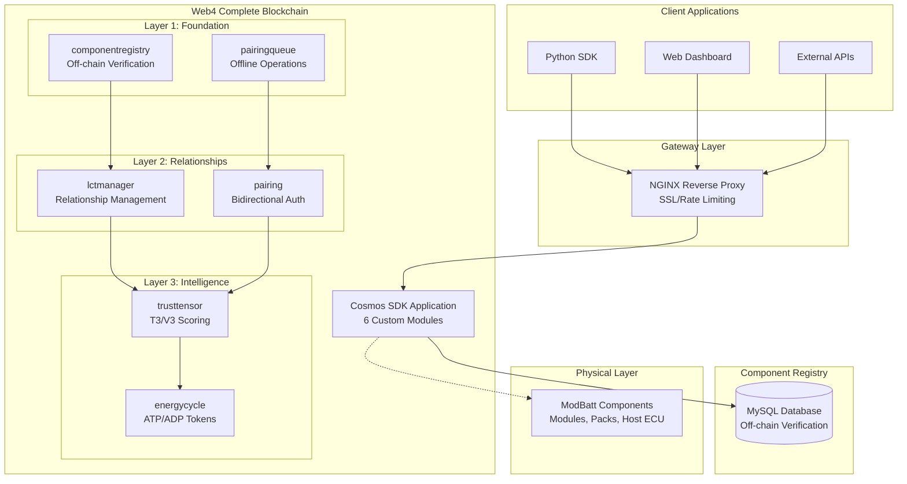
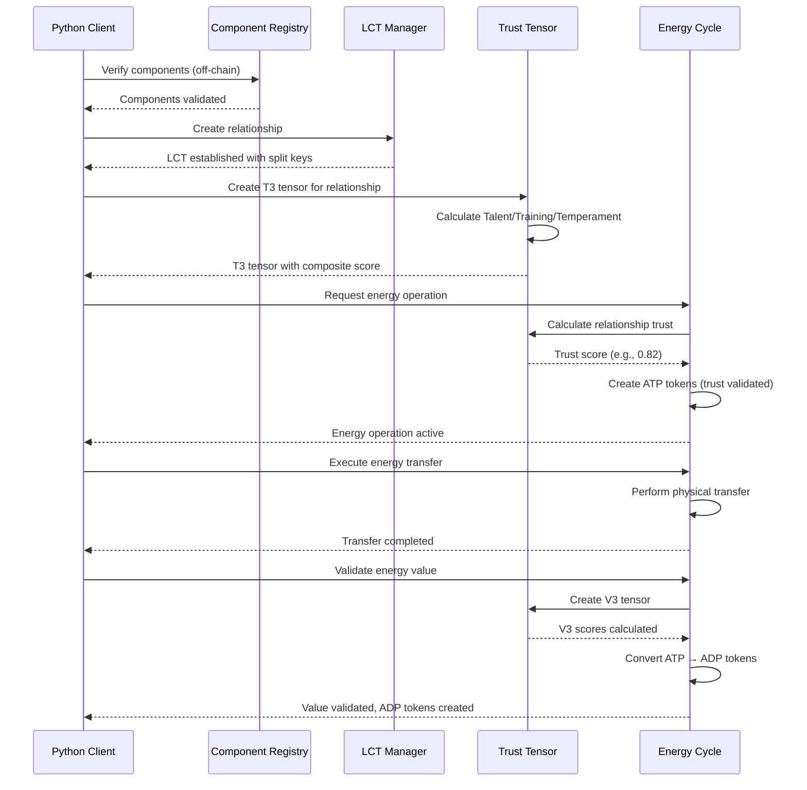

# Web4 Race Car Battery Management System - Complete 6-Module Documentation

## Table of Contents

1. [Executive Summary](#executive-summary)
2. [System Architecture](#system-architecture)
3. [Core Concepts](#core-concepts)
4. [API Reference](#api-reference)
5. [Development Guide](#development-guide)
6. [Deployment Guide](#deployment-guide)
7. [Troubleshooting](#troubleshooting)
8. [Appendices](#appendices)

---

## Executive Summary

### Business Overview

The Web4 Race Car Battery Management System represents a revolutionary approach to distributed energy management, built on ModBatt's innovative battery technology. The complete 6-module Web4 implementation introduces blockchain-based relationship management with integrated trust scoring and biological energy cycles that fundamentally change how battery components interact, authenticate, and validate value.

### Key Business Value

| Traditional Systems | Web4 Complete Innovation | Business Impact |
|---------------------|--------------------------|-----------------|
| Proprietary, vendor-locked | Universal compatibility with trust metrics | Reduced vendor dependency + intelligent decisions |
| Single points of failure | Distributed fault tolerance with energy validation | Enhanced reliability + proven value creation |
| Static configurations | Dynamic trust-based reconfiguration | Improved race performance + adaptive optimization |
| Manual pairing processes | Automated bidirectional pairing with T3/V3 scoring | Reduced operational costs + measurable trust |
| Binary trust decisions | Granular trust tensors (T3/V3) | Data-driven relationship management |
| Manual value assessment | Automated ATP/ADP biological energy cycles | Proven energy utility + value optimization |

### Technology Innovation

Web4's complete innovation stack includes:

- **LCTs as Relationships**: Not individual identities, but authenticated bonds between components
- **Split-Key Cryptography**: No PKI complexity, keys generated per relationship
- **T3 Trust Tensors**: Talent/Training/Temperament scoring for relationship trust
- **V3 Value Tensors**: Valuation/Veracity/Validity scoring for energy operations
- **ATP/ADP Energy Cycles**: Biological value model where energy requires trust validation
- **Trust-Integrated Operations**: All energy flows validated by relationship trust scores

---

## System Architecture

### Complete 6-Module Architecture



### Module Dependencies

**Clean Dependency Hierarchy**:
1. **componentregistry** (base - off-chain verification)
2. **pairingqueue** (depends on: componentregistry)
3. **lctmanager** (depends on: componentregistry, pairingqueue)
4. **pairing** (depends on: componentregistry, pairingqueue, lctmanager)
5. **trusttensor** (depends on: lctmanager)
6. **energycycle** (depends on: lctmanager, trusttensor)

### Core Components

#### 1. Component Registry Module
Off-chain component verification via pluggable MySQL backend.

**Key Features**:
- Manufacturer authentication and component verification
- Bidirectional pairing authorization rules
- Industry-specific pluggable verification systems
- Prevents blockchain bloat by keeping detailed data off-chain

#### 2. Pairing Queue Module
Offline operation support and proxy management.

**Key Features**:
- Queue pairing requests for offline components
- Proxy component management (Host ECU handling offline modules)
- Graceful degradation during connectivity issues
- Operation processing when components reconnect

#### 3. LCT Manager Module
Core Web4 innovation - manages relationships between components.

**Key Features**:
- LCTs represent relationships, not individual identities
- Split-key generation per relationship
- Many-to-many relationship support
- Trust anchor establishment for each pairing

#### 4. Pairing Module
Bidirectional authentication with challenge/response.

**Key Features**:
- Both components must authorize pairing with each other
- Cryptographic challenge/response protocol
- Session key establishment
- Integration with LCT Manager for relationship creation

#### 5. Trust Tensor Module *(New in Complete System)*
T3/V3 trust scoring for relationships and operations.

**Key Features**:
- **T3 Tensors** (Talent/Training/Temperament): Relationship trust scores
- **V3 Tensors** (Valuation/Veracity/Validity): Operation value validation
- Trust calculation algorithms for energy operation authorization
- Witness-based trust evidence collection

#### 6. Energy Cycle Module *(New in Complete System)*
ATP/ADP biological energy model with trust integration.

**Key Features**:
- **ATP Tokens**: Charged energy tokens requiring trust validation
- **ADP Tokens**: Discharged tokens proving successful value creation
- Trust-gated energy operations (minimum trust threshold required)
- V3 tensor integration for value validation
- Energy balance calculations with trust weighting

---

## Core Concepts

### 1. Trust Tensors (T3/V3)

**Revolutionary Addition**: Web4 moves beyond binary trust to granular, measurable trust relationships.

#### T3 Tensor: Relationship Trust
Attached to LCT relationships, measuring three dimensions:

- **Talent**: Inherent capabilities (hardware specs, manufacturing quality)
- **Training**: Learned performance (operational history, optimization)
- **Temperament**: Behavioral consistency (reliability, predictability)

**Example T3 Tensor**:
```json
{
  "tensor_id": "t3-lct-mod001-packa-001",
  "lct_id": "lct-MODBATT-MOD-001-PACK-A-1704067200",
  "tensor_type": "T3",
  "talent_score": 0.85,
  "training_score": 0.92,
  "temperament_score": 0.78,
  "context": "race_car_battery_management",
  "composite_score": 0.85
}
```

#### V3 Tensor: Operation Value Validation
Created per energy operation, measuring value creation:

- **Valuation**: Subjective utility rating from energy recipient
- **Veracity**: Objective accuracy (promised vs delivered energy)
- **Validity**: Delivery confirmation and timing compliance

### 2. ATP/ADP Energy Cycles

**Biological Model**: Energy operations mirror cellular ATP/ADP cycles where energy must prove its value.

#### Energy Operation Flow
1. **Energy Request**: Component requests energy from another via LCT relationship
2. **Trust Validation**: System calculates T3 trust score for source LCT
3. **ATP Creation**: If trust ≥ threshold (0.6), create charged ATP tokens
4. **Energy Transfer**: Execute physical energy transfer
5. **Value Validation**: Recipient provides utility rating and confirmation
6. **V3 Tensor Creation**: Calculate Valuation/Veracity/Validity scores
7. **ADP Conversion**: Convert ATP to ADP tokens with value certification

#### Trust-Energy Integration
```go
// Energy operation requires minimum trust threshold
if trustScore < 0.6 {
    return ErrInsufficientTrust
}

// Create ATP tokens only after trust validation
atpTokens := createAtpTokens(operation, trustScore)
```

### 3. Complete Web4 Workflow

The 6-module system creates a complete organism:



---

## API Reference

### Complete 6-Module REST API

Base URL: `https://your-domain.com/api`

#### Trust Tensor Operations *(New)*

##### Create Relationship Tensor
```http
POST /cosmos/tx/v1beta1/txs
Content-Type: application/json
```

**Request Body:**
```json
{
  "tx": {
    "body": {
      "messages": [{
        "@type": "/racecarweb.trusttensor.v1.MsgCreateRelationshipTensor",
        "creator": "cosmos1address",
        "lct_id": "lct-MODBATT-MOD-001-PACK-A-1704067200",
        "tensor_type": "T3",
        "context": "race_car_battery_management"
      }]
    }
  }
}
```

##### Update Tensor Score
```http
POST /cosmos/tx/v1beta1/txs
```

**Request Body:**
```json
{
  "tx": {
    "body": {
      "messages": [{
        "@type": "/racecarweb.trusttensor.v1.MsgUpdateTensorScore",
        "creator": "cosmos1address",
        "tensor_id": "t3-tensor-001",
        "dimension": "training",
        "value": "0.85",
        "context": "performance_improvement",
        "witness_data": "operational_data_hash"
      }]
    }
  }
}
```

##### Calculate Relationship Trust
```http
GET /racecarweb/trusttensor/v1/relationship-trust?lct_id={lct_id}&context={context}
```

**Response:**
```json
{
  "trust_score": "0.823",
  "factors": "talent:0.85,training:0.92,temperament:0.78,context_modifier:0.95"
}
```

#### Energy Cycle Operations *(New)*

##### Create Energy Operation
```http
POST /cosmos/tx/v1beta1/txs
```

**Request Body:**
```json
{
  "tx": {
    "body": {
      "messages": [{
        "@type": "/racecarweb.energycycle.v1.MsgCreateRelationshipEnergyOperation",
        "creator": "cosmos1address",
        "source_lct": "lct-pack-a-host-001",
        "target_lct": "lct-host-pack-b-001",
        "energy_amount": "50.0",
        "operation_type": "discharge"
      }]
    }
  }
}
```

**Response:**
```json
{
  "tx_response": {
    "code": 0,
    "events": [
      {
        "type": "energy_operation_created",
        "attributes": [
          {"key": "operation_id", "value": "energy-op-discharge-001"},
          {"key": "atp_tokens", "value": "atp-001,atp-002,atp-003"},
          {"key": "trust_validated", "value": "true"}
        ]
      }
    ]
  }
}
```

##### Validate Energy Value (ATP → ADP)
```http
POST /cosmos/tx/v1beta1/txs
```

**Request Body:**
```json
{
  "tx": {
    "body": {
      "messages": [{
        "@type": "/racecarweb.energycycle.v1.MsgValidateRelationshipValue",
        "creator": "cosmos1address",
        "operation_id": "energy-op-discharge-001",
        "recipient_validation": "confirmed",
        "utility_rating": "0.92",
        "trust_context": "race_performance"
      }]
    }
  }
}
```

##### Get Energy Balance
```http
GET /racecarweb/energycycle/v1/relationship/{lct_id}/balance
```

**Response:**
```json
{
  "atp_balance": "47.5",
  "adp_balance": "152.3",
  "total_energy": "199.8",
  "trust_weighted_balance": "164.2"
}
```

### Complete Python SDK Integration

```python
from web4_client import Web4Client

client = Web4Client("http://localhost:1317")

# Complete workflow demonstration
def demo_complete_web4():
    # 1. Component verification (off-chain)
    comp_a = client.register_component("MODBATT-MOD-001", "module")
    comp_b = client.register_component("MODBATT-PACK-A", "pack")
    
    # 2. Create LCT relationship
    pairing = client.initiate_bidirectional_pairing("MODBATT-MOD-001", "MODBATT-PACK-A")
    lct_id = pairing['lct_id']
    
    # 3. Create trust tensor
    tensor = client.create_relationship_tensor(lct_id, "T3", "race_car_demo")
    tensor_id = tensor['tensor_id']
    
    # 4. Update trust scores based on performance
    client.update_tensor_score(tensor_id, "training", 0.85, "performance_data")
    client.update_tensor_score(tensor_id, "temperament", 0.92, "reliability_data")
    
    # 5. Calculate composite trust
    trust_score, factors = client.calculate_relationship_trust(lct_id, "energy_operation")
    print(f"Trust Score: {trust_score}, Factors: {factors}")
    
    # 6. Create energy operation (ATP tokens)
    energy_op = client.create_energy_operation(lct_id, "target_lct", 50.0, "discharge")
    operation_id = energy_op['operation_id']
    
    # 7. Execute energy transfer
    client.execute_energy_transfer(operation_id, "race_car_energy_data")
    
    # 8. Validate energy value (ATP → ADP conversion)
    validation = client.validate_energy_value(operation_id, 0.88, "confirmed", "race_performance")
    v3_score = validation['v3_score']
    adp_tokens = validation['adp_tokens']
    
    # 9. Check final energy balance
    balance = client.get_energy_balance(lct_id)
    print(f"Energy Balance: ATP={balance['atp_balance']}, ADP={balance['adp_balance']}")
    print(f"Trust-Weighted Balance: {balance['trust_weighted_balance']}")

# Demonstrates complete Web4 organism:
# Identity → Relationships → Trust → Energy → Value
```

---

## Development Guide

### Complete System Setup

#### Prerequisites for 6-Module System

- **Cosmos SDK**: v0.53.0 (collections framework required)
- **Ignite CLI**: v29.0.0+ (for v29 collections support)
- **Go**: 1.21+ (required for Cosmos SDK v0.53)
- **MySQL**: 8.0+ (for component registry)
- **Python**: 3.9+ (for complete SDK)

#### Build Complete 6-Module System

```bash
# Clone and setup
git clone https://github.com/your-org/web4-racecar-demo.git
cd racecar-web

# Build complete system
ignite chain build

# Initialize with all 6 modules
ignite chain serve
```

#### Module-Specific Development

**Trust Tensor Module**:
```bash
# Add new trust calculation algorithm
ignite scaffold message update-trust-algorithm algorithm_name:string parameters:string --module trusttensor

# Add tensor witness functionality
ignite scaffold message add-tensor-witness tensor_id:string witness_lct:string evidence:string --module trusttensor
```

**Energy Cycle Module**:
```bash
# Add energy efficiency tracking
ignite scaffold type energy-efficiency-record operation_id:string efficiency_score:string factors:string --module energycycle

# Add ATP/ADP token analytics
ignite scaffold query get-token-analytics lct_id:string time_range:string --module energycycle
```

### Testing Complete System

#### Integration Tests

```python
def test_complete_web4_integration():
    """Test full 6-module integration"""
    client = Web4Client()
    
    # Test component → relationship → trust → energy flow
    components = ["MODBATT-MOD-001", "MODBATT-PACK-A"]
    
    # 1. Register components
    for comp in components:
        result = client.register_component(comp, get_component_type(comp))
        assert result['code'] == 0
    
    # 2. Create relationship
    pairing = client.initiate_bidirectional_pairing(components[0], components[1])
    lct_id = extract_lct_id(pairing)
    assert lct_id is not None
    
    # 3. Create and update trust tensor
    tensor = client.create_relationship_tensor(lct_id, "T3")
    client.update_tensor_score(tensor['tensor_id'], "training", 0.85)
    
    # 4. Validate trust calculation
    trust_score, factors = client.calculate_relationship_trust(lct_id, "energy_test")
    assert float(trust_score) >= 0.6  # Minimum trust threshold
    
    # 5. Test energy operation with trust validation
    energy_op = client.create_energy_operation(lct_id, "target_lct", 25.0)
    assert energy_op['trust_validated'] == True
    
    # 6. Complete energy cycle
    client.execute_energy_transfer(energy_op['operation_id'])
    validation = client.validate_energy_value(energy_op['operation_id'], 0.9)
    assert len(validation['adp_tokens']) > 0
```

---

## Deployment Guide

### Production Architecture for Complete System

#### Enhanced Infrastructure Requirements

| Component | 6-Module Requirements | Scaling Notes |
|-----------|----------------------|---------------|
| Blockchain Nodes | 8 CPU, 16GB RAM, 1TB NVMe | Trust/Energy calculations are CPU intensive |
| MySQL Database | 4 CPU, 8GB RAM, 500GB SSD | Increased component verification load |
| NGINX Gateway | 4 CPU, 4GB RAM | Enhanced for trust tensor API endpoints |

#### Complete System Configuration

**Cosmos Parameters for Trust/Energy Modules**:
```json
{
  "trusttensor": {
    "max_tensor_updates_per_block": 100,
    "trust_calculation_timeout": "5s",
    "minimum_witness_count": 2
  },
  "energycycle": {
    "minimum_trust_threshold": "0.6",
    "atp_token_expiration": "86400s",
    "max_energy_per_operation": "1000.0"
  }
}
```

#### Performance Monitoring

**Additional Metrics for Complete System**:
- Trust calculation latency (target: <10ms)
- Energy operation throughput (target: 100 ops/sec)
- ATP/ADP token creation rate
- V3 tensor validation success rate

---

## Troubleshooting

### Trust Tensor Issues

**Problem**: Trust calculations timeout
```bash
# Check trust tensor keeper logs
journalctl -u racecar-webd | grep "trusttensor"

# Increase calculation timeout
racecar-webd config set app trust_calculation_timeout 10s
```

**Problem**: T3 scores not updating
```bash
# Verify tensor exists
racecar-webd query trusttensor get-relationship-tensor lct-id T3

# Check witness data integrity
racecar-webd query trusttensor get-tensor-history tensor-id
```

### Energy Cycle Issues

**Problem**: ATP tokens not created (trust threshold)
```bash
# Check trust score
racecar-webd query trusttensor calculate-relationship-trust lct-id energy_operation

# Verify minimum threshold (should be ≥ 0.6)
racecar-webd query energycycle params
```

**Problem**: ADP conversion failures
```bash
# Check V3 tensor creation
racecar-webd query trusttensor get-relationship-tensor lct-id V3

# Verify ATP token status
racecar-webd query energycycle get-energy-flow-history lct-id
```

---

## Appendices

### Appendix A: Complete Web4 Architecture Summary

**6-Module System Overview**:
1. **componentregistry**: Off-chain verification (foundation)
2. **pairingqueue**: Offline operation support (resilience)
3. **lctmanager**: Relationship management (core innovation)
4. **pairing**: Bidirectional authentication (security)
5. **trusttensor**: T3/V3 trust scoring (intelligence)
6. **energycycle**: ATP/ADP value cycles (biological model)

### Appendix B: Trust Tensor Calculations

**T3 Composite Score Formula**:
```
T3_composite = (Talent × 0.3) + (Training × 0.4) + (Temperament × 0.3)
Final_Score = T3_composite × Context_Modifier
```

**V3 Composite Score Formula**:
```
V3_composite = (Valuation × 0.4) + (Veracity × 0.3) + (Validity × 0.3)
Value_Certification = V3_composite ≥ 0.7
```

### Appendix C: Energy Cycle Constants

```go
const (
    EnergyQuantumKWh = 1.0              // 1 kWh per ATP token
    MaxEnergyPerOperation = 1000.0      // Maximum kWh per operation  
    MinTrustThreshold = 0.6             // Minimum trust for energy ops
    AtpTokenExpirationTime = 86400      // 24 hours in seconds
)
```

### Appendix D: Complete API Endpoint Reference

#### Trust Tensor Endpoints
- `POST /trusttensor/create-relationship-tensor`
- `POST /trusttensor/update-tensor-score` 
- `GET /trusttensor/calculate-relationship-trust`
- `GET /trusttensor/get-relationship-tensor`

#### Energy Cycle Endpoints
- `POST /energycycle/create-relationship-energy-operation`
- `POST /energycycle/execute-energy-transfer`
- `POST /energycycle/validate-relationship-value`
- `GET /energycycle/relationship/{id}/balance`
- `GET /energycycle/energy-flow-history`

---

**Document Version**: 2.0 - Complete 6-Module System  
**Last Updated**: December 2024  
**Next Review**: March 2025  

This documentation covers the complete Web4 Race Car Battery Management System with all 6 modules, providing the full organism that transforms individual components into an intelligent, trust-based energy management ecosystem.